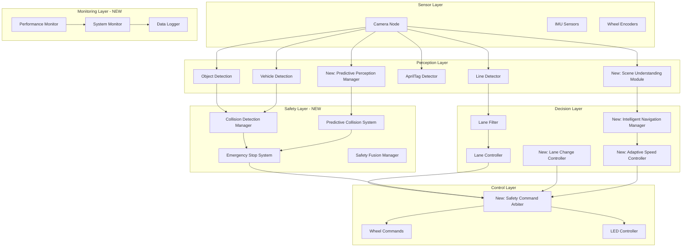
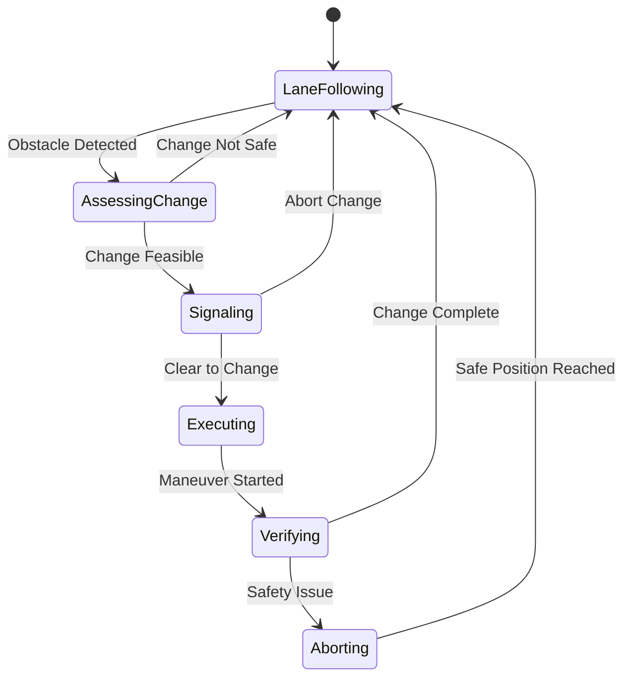

# Advanced Safety Navigation System - Design Document

## Overview

This design document outlines the architecture for enhancing the existing Duckietown Safe Navigation system with advanced safety features, dynamic lane changing, and state-of-the-art autonomous navigation capabilities. The design maintains the proven modular ROS-based architecture while adding sophisticated safety layers, predictive capabilities, and intelligent decision-making systems.

The enhancement strategy follows a layered approach where new advanced features are implemented as additional ROS nodes that integrate seamlessly with the existing system, ensuring backward compatibility and the ability to gracefully degrade to the current working functionality if needed.

## Architecture

### System Architecture Overview



### Core Design Principles

1. **Modular Enhancement**: New features are implemented as separate ROS nodes that can be enabled/disabled independently
2. **Safety First**: Multiple redundant safety systems with fail-safe mechanisms
3. **Graceful Degradation**: System can fall back to simpler, proven functionality if advanced features fail
4. **Real-time Performance**: All safety-critical operations maintain sub-100ms response times
5. **Backward Compatibility**: Existing functionality remains unchanged and operational

## Components and Interfaces

### 1. Enhanced Perception System

#### Predictive Perception Manager (PPM)
**Purpose**: Advanced object tracking and trajectory prediction
**Key Features**:
- Multi-object tracking using Kalman filters
- Trajectory prediction using motion models
- Confidence estimation for predictions
- Integration with existing object detection

**ROS Interface**:
```python
# Publishers
~/predicted_trajectories (PredictedTrajectoryArray)
~/tracking_confidence (TrackingConfidence)
~/scene_analysis (SceneAnalysis)

# Subscribers  
~/object_detections (ObjectDetectionArray)
~/vehicle_detections (VehicleCorners)
~/lane_pose (LanePose)
~/car_cmd (Twist2DStamped)
```

#### Scene Understanding Module (SUM)
**Purpose**: High-level scene interpretation and context awareness
**Key Features**:
- Traffic scenario classification (intersection, lane following, obstacle avoidance)
- Environmental condition assessment (lighting, visibility)
- Multi-modal sensor fusion
- Semantic scene understanding

### 2. Advanced Safety System

#### Emergency Stop System (ESS)
**Purpose**: Immediate collision avoidance and emergency response
**Key Features**:
- Hardware-level emergency stop capability
- Multiple trigger conditions (proximity, prediction, manual)
- Sub-100ms response time guarantee
- Fail-safe operation mode

**ROS Interface**:
```python
# Publishers
~/emergency_status (EmergencyStatus)
~/safety_override (Twist2DStamped)

# Subscribers
~/collision_risk (CollisionRisk)
~/manual_emergency (BoolStamped)
~/system_health (SystemHealth)

# Services
~/trigger_emergency_stop (TriggerEmergencyStop)
~/reset_emergency_system (ResetEmergencySystem)
```

#### Collision Detection Manager (CDM)
**Purpose**: Multi-layered collision detection and risk assessment
**Key Features**:
- Distance-based collision detection
- Velocity-based time-to-collision calculation
- Predictive collision assessment using trajectory forecasting
- Risk level classification (LOW, MEDIUM, HIGH, CRITICAL)

#### Safety Fusion Manager (SFM)
**Purpose**: Coordinate multiple safety systems and arbitrate decisions
**Key Features**:
- Multi-sensor safety data fusion
- Safety system health monitoring
- Decision arbitration between competing safety actions
- Safety event logging and analysis

### 3. Intelligent Navigation System

#### Lane Change Controller (LCC)
**Purpose**: Safe and efficient lane changing capabilities
**Key Features**:
- Lane change feasibility assessment
- Multi-phase lane change execution (signal, check, execute, verify)
- Abort capability with safe fallback
- Integration with traffic rules and right-of-way

**State Machine**:


#### Intelligent Navigation Manager (INM)
**Purpose**: High-level navigation decision making and coordination
**Key Features**:
- Multi-objective path planning (safety, efficiency, traffic rules)
- Dynamic route adaptation based on conditions
- Integration with intersection navigation
- Coordination between different navigation modes

#### Adaptive Speed Controller (ASC)
**Purpose**: Dynamic speed adjustment based on environmental conditions
**Key Features**:
- Multi-factor speed calculation (visibility, traffic, road conditions)
- Smooth acceleration/deceleration profiles
- Integration with safety systems
- Predictive speed adjustment based on upcoming scenarios

### 4. Enhanced Communication System

#### Vehicle-to-Vehicle Communication (V2V)
**Purpose**: Coordinate with other Duckiebots for safer navigation
**Key Features**:
- Position and intention broadcasting
- Collision avoidance coordination
- Intersection negotiation
- Emergency alert propagation

#### Advanced LED Signaling System
**Purpose**: Enhanced visual communication with clear intentions
**Key Features**:
- Extended signal patterns for complex maneuvers
- Emergency and warning signals
- Adaptive brightness based on ambient conditions
- Integration with navigation decisions

## Data Models

### Core Data Structures

#### PredictedTrajectory
```python
class PredictedTrajectory:
    object_id: int
    trajectory_points: List[Point3D]  # Future positions over time
    confidence: float  # 0.0 to 1.0
    time_horizon: float  # seconds
    velocity: Twist2D
    acceleration: Twist2D
```

#### CollisionRisk
```python
class CollisionRisk:
    risk_level: int  # 0=NONE, 1=LOW, 2=MEDIUM, 3=HIGH, 4=CRITICAL
    time_to_collision: float  # seconds, -1 if no collision predicted
    collision_point: Point3D
    involved_objects: List[int]  # object IDs
    recommended_action: int  # CONTINUE, SLOW, STOP, EVADE
```

#### SafetyStatus
```python
class SafetyStatus:
    emergency_active: bool
    safety_systems_health: Dict[str, bool]
    active_risks: List[CollisionRisk]
    safety_margins: SafetyMargins
    last_safety_event: SafetyEvent
```

#### LaneChangeRequest
```python
class LaneChangeRequest:
    direction: int  # -1=LEFT, 1=RIGHT
    reason: str  # "obstacle_avoidance", "optimization", "navigation"
    urgency: int  # 1=LOW, 2=MEDIUM, 3=HIGH
    feasibility_score: float  # 0.0 to 1.0
    estimated_duration: float  # seconds
```

### Configuration Parameters

#### Safety System Configuration
```yaml
safety_system:
  emergency_stop:
    min_distance_threshold: 0.3  # meters
    max_response_time: 0.1  # seconds
    enable_predictive_stop: true
  
  collision_detection:
    time_horizon: 3.0  # seconds
    confidence_threshold: 0.7
    risk_update_rate: 20  # Hz
  
  safety_margins:
    following_distance: 2.0  # seconds
    lateral_clearance: 0.2  # meters
    intersection_clearance: 0.5  # meters
```

#### Lane Change Configuration
```yaml
lane_change:
  signal_duration: 2.0  # seconds
  max_maneuver_time: 8.0  # seconds
  abort_threshold: 0.3  # risk level
  lateral_acceleration_limit: 0.5  # m/s²
  
  feasibility_checks:
    - adjacent_lane_clear: true
    - sufficient_gap: true
    - safe_merge_distance: true
    - no_oncoming_traffic: true
```

## Error Handling

### Safety System Error Handling

1. **Sensor Failure Detection**
   - Continuous sensor health monitoring
   - Automatic fallback to redundant sensors
   - Graceful degradation with reduced capabilities
   - Emergency stop if critical sensors fail

2. **Communication Failures**
   - Timeout detection for inter-node communication
   - Automatic retry mechanisms with exponential backoff
   - Fallback to local decision making
   - Alert generation for persistent failures

3. **Actuator Failures**
   - Motor health monitoring through encoder feedback
   - Immediate emergency stop on actuator failure
   - Safe shutdown procedures
   - Manual override capabilities

### Navigation System Error Handling

1. **Localization Failures**
   - Confidence monitoring for lane pose estimation
   - Fallback to dead reckoning with reduced speed
   - Stop and wait behavior if localization is completely lost
   - Recovery procedures when localization is restored

2. **Planning Failures**
   - Timeout detection for path planning algorithms
   - Fallback to simpler navigation strategies
   - Safe stop if no valid path can be found
   - Human intervention request for complex scenarios

## Testing Strategy

### Simulation Testing Framework

1. **Gazebo Integration**
   - Enhanced Duckietown simulation environment
   - Multiple vehicle scenarios
   - Configurable obstacle and traffic patterns
   - Automated test scenario generation

2. **Safety System Validation**
   - Collision scenario testing
   - Emergency stop response time measurement
   - Sensor failure simulation
   - Edge case scenario testing

### Real-World Testing Protocol

1. **Incremental Deployment**
   - Feature-by-feature activation
   - Controlled environment testing first
   - Gradual complexity increase
   - Continuous safety monitoring

2. **Performance Metrics**
   - Safety event frequency and response times
   - Navigation efficiency measurements
   - System reliability statistics
   - Battery life impact assessment

### Validation Criteria

1. **Safety Requirements**
   - Zero collisions in 1000+ test runs
   - Emergency stop response < 100ms
   - 99.9% safety system uptime
   - Graceful degradation in all failure modes

2. **Performance Requirements**
   - Lane change success rate > 95%
   - Navigation efficiency within 10% of optimal
   - Real-time operation at 10Hz minimum
   - Battery life impact < 15%

## Integration Plan

### Phase 1: Safety System Foundation (Weeks 1-3)
- Implement Emergency Stop System
- Develop Collision Detection Manager
- Create Safety Fusion Manager
- Basic safety testing and validation

### Phase 2: Enhanced Perception (Weeks 4-6)
- Implement Predictive Perception Manager
- Develop Scene Understanding Module
- Integrate with existing object detection
- Perception accuracy testing

### Phase 3: Intelligent Navigation (Weeks 7-10)
- Implement Lane Change Controller
- Develop Adaptive Speed Controller
- Create Intelligent Navigation Manager
- Navigation behavior testing

### Phase 4: System Integration (Weeks 11-12)
- Full system integration testing
- Performance optimization
- Real-world validation
- Documentation and deployment

### Phase 5: Advanced Features (Weeks 13-15)
- V2V communication implementation
- Advanced LED signaling
- System monitoring and diagnostics
- Final validation and certification

## Performance Considerations

### Computational Requirements
- Target: Maintain real-time performance on Jetson Nano
- Memory usage: < 2GB additional RAM
- CPU usage: < 50% additional load
- GPU usage: Optimize neural network inference

### Network Communication
- Minimize inter-node message frequency
- Use efficient message serialization
- Implement message prioritization
- Monitor network latency and bandwidth

### Power Management
- Optimize algorithm efficiency
- Implement adaptive processing based on battery level
- Power-aware feature activation
- Emergency power conservation mode

This design provides a comprehensive framework for enhancing the Duckietown system while maintaining its proven real-world functionality and ensuring safe, reliable operation in complex autonomous navigation scenarios.